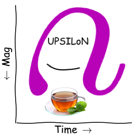

# UPSILoN-T

<div align="center">
<br/>
[ UPSILoN-T ]
</div><br>

UPSILoN-T (UPSILoN Using <b>T</b>ransfer Learning) is the successor to [UPSILoN](https://goo.gl/xmFO6Q). As UPSILoN does, UPSILoN-T aims to classify periodic variable light curves using their time-variability features. The main differences between UPSILoN-T and UPSILoN is as follows:  

 * UPSILoN-T uses Deep Neural Network ([CNN](https://en.wikipedia.org/wiki/Convolutional_neural_network)) whereas UPSILoN used [Random Forests](https://en.wikipedia.org/wiki/Random_forest).
    - 2.1% improvement of classification quality ([F1 score](http://en.wikipedia.org/wiki/F1_score)) when compared to the UPSILoN model. 
    - the trained CNN model is significantly smaller than the UPSILoN model (i.e. ~2MB v.s ~4.15GB).

 * UPSILoN-T utilizes [transfer learning](https://en.wikipedia.org/wiki/Transfer_learning).
    - UPSILoN-T allows users to customize the trained CNN model for their own time-variability surveys even if they do not have large-enough dataset. UPSILoN does not offer such functionality.


## Requirement

- PyTorch 1.4+ with CUDA support.
    - https://pytorch.org/
- Scikit-Learn, Numpy, Scipy, Pandas
    - If not installed, UPSILoN-T will automatically install them.

## Installation

## GPU Check

```python
import torch

torch.cuda.is_available()
```

UPSILoN-T needs PyTorch with CUDA and thus the above code must return ```True```.

## How to Use UPSILoN-T

Let's run the following code from Python console.

```python
import time
import pandas as pd

from upsilont import UPSILoNT
from upsilont.features import VariabilityFeatures
from upsilont.datasets import load_lc
from upsilont import Logger

date, mag, err = load_lc()

index = mag < 99.999
date = date[index]
mag = mag[index]
err = err[index]

logger = Logger().getLogger()
logger.info('Extract variability features.')

feature_list = []
for i in range(1):
    var_features = VariabilityFeatures(date, mag, err).get_features()
    feature_list.append(var_features)

logger.info('Convert to Pandas DataFrame.')
features = pd.DataFrame(feature_list)

logger.info('Predict Using UPSILoN-T.')
ut = UPSILoNT(logger=logger)
label, prob = ut.predict(features, return_prob=True)

logger.info('Predicted Class: {0}'.format(label))
logger.info('Done.')

logger.handlers = []
```

The above code returns outputs similar with the following:

```angular2
2020-XX-XX 09:05:25,940 [<ipython>:17] INFO - Extract variability features.
2020-XX-XX 09:05:26,080 [<ipython>:28] INFO - Convert to Pandas DataFrame.
2020-XX-XX 09:05:26,081 [<ipython>:31] INFO - Predict Using UPSILoN-T.
2020-XX-XX 09:05:28,032 [<ipython>:35] INFO - Predicted Class: ['RRL_ab']
2020-XX-XX 09:05:28,033 [<ipython>:36] INFO - Done.
``` 

The ```Predicted Class``` must be ```['RRL_ab']```, which is a list of labels for input data. We explain details about the code in the following sections.


### Time-Variability Feature Extraction

UPSILoN-T needs a list of magnitudes, time (in days), and the error of magnitudes (optional). Then UPSILoN-T can extract 16 variability features as follows:

```python
date = ...
mag = ...
# Error of magnitude is optional.
err = ...

feature_list = []
for i in range(1):
    var_features = VariabilityFeatures(date, mag, err).get_features()
    feature_list.append(var_features)
```

We add 16 variability features of each light-curve to a list ```feature_list```, which is an input for UPSILoN-T prediction function. The above code shows an example for a single light-curve. If one has many light-curves, he/she has to append the extracted variability features to ```feature_list```. 

### Periodic Variable Classification

Once we build a list of variability features, ```feature_list```, we can use UPSILoN-T to predict variable classes of each light-curve as follow:

```python
# Convert to Pandas DataFrame.
features = pd.DataFrame(feature_list)

# Predict.
ut = UPSILoNT()
label, prob = ut.predict(features, return_prob=True)
```

We need to convert ```feature_list``` to Pandas Dataframe as shown in the code. The ```label``` is a list of predicted variable classes, and ```prob``` is a list of probabilities for all classes.

### Transfer Learning

In order to transfer the pre-trained UPSLIoN-T model, we need ```features``` and ```labels```. ```features``` is a list of 16 variability features (in Pandas DataFrame), and ```labels``` is a list of corresponding variable classes. The following code shows how to transfer the UPTILoN-T model.

```python
# Specify which GPU to use.
ut = UPSILoNT('cuda:0')

# Start transfer learning and write outputs to the folder "/path/to/outputs/".
ut.transfer(features, labels, '/path/to/outputs/')
```

The function ```ut.transfer``` has several parameters can be tuned as follows:

| Parameter     | Description           |
| -------------: |:---------------------|
| n_iter      | Number of training iteration. Default is 3. For each ietration, randomly split training and test set is generated. |
| n_epoch      | Number of training epochs. Default is 50. During the whole training epochs, same training and test set is used. |
| train_size | A ratio to split training and test set. Default is 0.8. |
| weight_class | Weight each class by its frequencies to deal with imbalanced dataset. Default is False. |
| balanced_sampling | Oversample training set to deal with imbalanced dataset. Default is False. |
| train_last | If True, transfer only the last fully connected layer in the network. If False, transfer the entire layers in the network. Default is False.  |
| refit | Refit network after the training finished using the entire dataset. Default is False. |
| refit_n_epoch | The number of training epochs to refit the network. Default is 100. |
| verbose | Print training message. Default is True. |

Based on the parameter settings, transferred results could vary a lot.

### Training From Scratch

If there are enough light-curves to train a network from scratch, it is recommended to train a network from scratch as follows:

```python
ut = UPSILoNT()
ut.train(features, labels, '/path/to/outputs/',
         n_iter=30, n_epoch=500)
```

In this case, we recommend to set ```n_iter``` and ```n_epoch``` larger than the default values since the optimization of network starts from random initialization of weights. The function ```ut.train``` has the same parameters as the function ```ut.transfer```. You can tune the parameters to get a model showing the best classification performances. 


## ChangeLog

#### v0.1.0 (2020/xx/xx)
- release of alpha version
  - provides a pre-trained DNN model.
  - provide modules for feature-extraction, training, prediction and transferring.


## Citation

If you use UPSILoN-T in publication, we would appreciate citations to the paper, [Kim et al. 2020 (in Progress)](), which is based on the UPSILoN-T version 0.1.0.


## Contact
Dae-Won Kim, email: dwkim78 at gmail.com

Webpage: https://sites.google.com/site/dwkim78/


#### Keywords

deep learning - transfer learning - classification - astronomy - periodic variables - light curves - variability features - time-series survey
